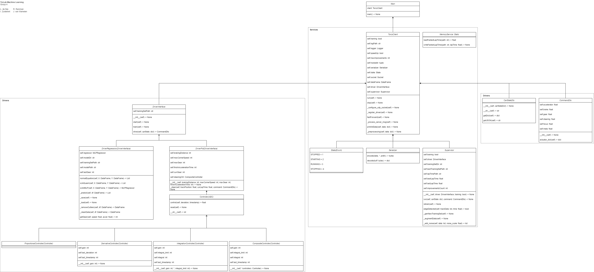

# TINLABML_22-23 
## Group 4
TinLab Machine Learning files belonging to Group 4:
<li>Ian Zuiderent 1004784</li>
<li>Leandro de Nijs 1003440</li>
<li>Jurre van Wamelen 1009652</li>
<li>Rinish Ramman 0943275</li>

Using this repository, we assume you already have a working Torcs/Python environment. If not, please see: [TINLABML_22-23](https://github.com/ElviravdVen/TINLABML_22-23).

## Assignment Code
### Directory Tree
Relevant assignment code can be found under:
```
opdrachten
    └───groepsopdracht_final_torcs
        ├───ClientCode
        │   ├───Drivers
        │   ├───Dto
        │   ├───Models
        │   ├───Services
        └───Logs
            └───train_data
```
### Class Diagram
The structure of the code is as follows:


## Running the Torcs Client
### Docker
The easiest way to run the client is to make use of Docker. Docker automatically pulls all the required files in its own container (See: [Installing Docker](https://docs.docker.com/engine/install/)). The client can then be run using:
```sh
~$ docker pull ianzui/tinlab-machinelearning:latest
~$ docker run ianzui/tinlab-machinelearning
```

### Source Code
#### Installing Packages
Another way to run the client is by directly using the Source Code. This does require you to manually install the required packages. This can either be done by using the 'requirements.txt' file, or by seperately installing the packages (See: [Installing Packages](https://packaging.python.org/en/latest/tutorials/installing-packages/)). The 'requirements.txt' file can be found under:
```
opdrachten
    └───groepsopdracht_final_torcs
        └───ClientCode
                └───requirements.txt
```
The entrypoint of the code is the 'main.py' file. This file has to be run using Python, and can be found under:
```
opdrachten
    └───groepsopdracht_final_torcs
        └───ClientCode
                └───main.py
```

The client can then be run using:
```sh
~$ python3 <PATHTOMAIN.PY>
```

### Arguments
```
usage:  main.py [-h] [-i IPADDRESS] [-p PORT] [-t TRAINING]
OR      ianzui/tinlab-machinelearning [-h] [-i IPADDRESS] [-p PORT] [-t TRAINING]

optional arguments:
    -h, --help                            Show this help message and exit
    -i IPADDRESS, --ipaddress IPADDRESS   Torcs Server IP-Address
    -p PORT, --port           PORT        Torcs Server Port
    -t TRAINING, --training   TRAINING    Go into training mode (unavailable when using Docker)
```

## Training
**Unavailable when using Docker!**

The Torcs Client can be further trained, if wanted by the user. This can be done by using the 'Training' optional argument (See: [Arguments](#Arguments)). The Client will then boot in Training Mode. In Training Mode, the Client will try to speed up Torcs just after every race start. To accomplish this, the Client will simulate keyboard strokes. To make this work, the currently active window has to be the Torcs game.

### Training Summary
The car drives 1 lap each time, for this lap the model is trained with existing training data, only noise is added to all sensor data. Then the car will drive a lap and this lap time is saved. If the lap time is faster than the last fastest lap time, this time is overwritten and the training data is also overwritten. If the car was slower, nothing happens and the simulation is restarted. The simulation is also restarted if the car is off the track for more than 10 seconds. Thus, while the car can be faster by, for example, driving a small distance off the track, we avoid waiting unnecessarily long for a car that has crashed.
\
\
By adjusting the data slightly each time, an approximation of the optimal time would theoretically be possible. To avoid overfitting by aiming for the optimal time on one track, it was decided that there will be a maximum of 10× improvement before training stops. This will prevent the car from running one track very well and, as a result, not running another.